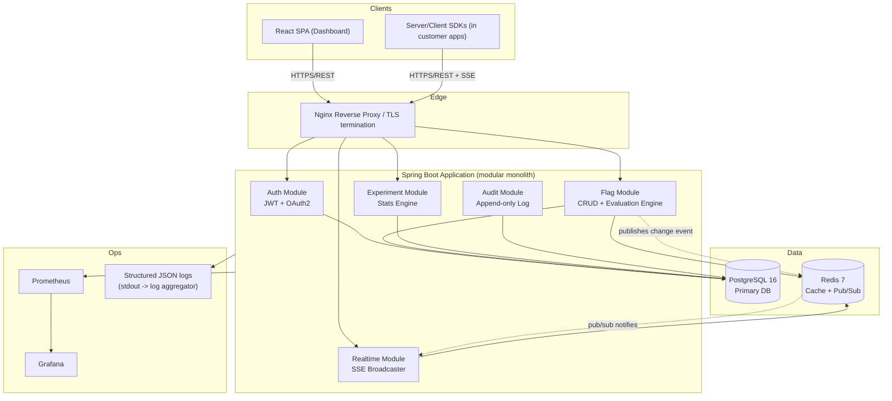
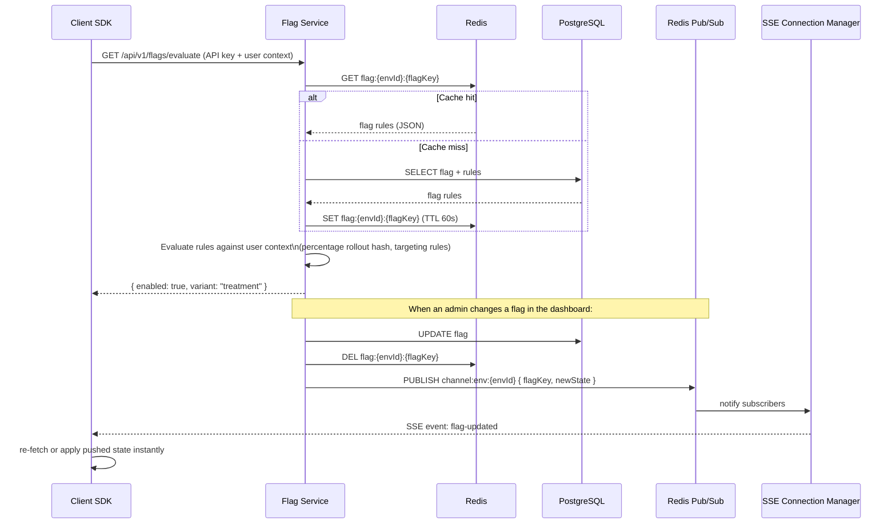

# System Architecture

## High-Level Architecture

**Why a modular monolith, not microservices?** At the scale this project targets (single dev, 6–10 weeks, portfolio-grade), microservices add network-boundary complexity (service discovery, distributed tracing, inter-service auth) without a corresponding benefit — there's no team-scaling problem to solve yet. The codebase is structured in **clearly bounded modules** (`auth`, `flag`, `experiment`, `audit`) with well-defined interfaces, so it could be split into services later with minimal rework. This is itself a good interview talking point: "I designed for a modular monolith now, with clear seams to extract services later, because Conway's Law says microservices should mirror team boundaries — and there's one team."

## Flag Evaluation & Real-Time Propagation Flow

## Component Responsibilities

| Component | Responsibility |
|---|---|
| **API Gateway (Nginx)** | TLS termination, request routing, rate-limit headers, gzip |
| **Auth Module** | Signup/login, JWT issuance + refresh, OAuth2 (Google), password hashing (BCrypt) |
| **Flag Module** | Flag CRUD, rule engine (percentage rollout via consistent hashing, user targeting), evaluation endpoint |
| **Experiment Module** | Experiment lifecycle, exposure/conversion event ingestion, statistical significance calculation |
| **Audit Module** | Append-only log of every mutating action, queryable by actor/resource/time |
| **Realtime Module** | Manages SSE connections per environment, broadcasts on Redis pub/sub message |
| **Redis** | (1) Flag-rule cache to avoid DB hit on every evaluation call, (2) pub/sub bus for real-time fan-out |
| **PostgreSQL** | System of record: orgs, projects, environments, flags, rules, experiments, events, audit log |

## Notifications & Monitoring

- **Notifications:** Webhook dispatch (outbound HTTP POST) on flag state change — foundation for future Slack/Discord integration. Implemented as an async `@EventListener` + retry queue, not inline in the request path (so a slow webhook receiver never slows down a flag evaluation call).
- **Logging:** Structured JSON logs (via Logback + `logstash-logback-encoder`) to stdout, so they're container-log-driver friendly (Docker → any aggregator).
- **Monitoring:** Spring Boot Actuator exposes `/actuator/prometheus`; Prometheus scrapes it; Grafana dashboards for request latency, flag-evaluation QPS, cache hit ratio, SSE connection count.
- **Analytics:** Experiment exposure/conversion events feed the stats engine — this *is* the product's analytics layer (see Experiment Module).

## Caching Strategy

Flag rules are cached in Redis with a **60-second TTL as a safety net**, but the primary invalidation path is **explicit cache-busting on write**: any flag mutation immediately does `DEL` on the cache key and publishes the change. This gives strong consistency (no waiting for TTL expiry) while the TTL protects against a missed invalidation event turning into permanent staleness.

## Message Queue Usage

Rather than a heavyweight broker (Kafka/RabbitMQ) for a single-instance portfolio deployment, **Redis Streams** is used for the experiment event ingestion pipeline (`XADD` on exposure/conversion events, a consumer group processes them into aggregate stats asynchronously). This is called out explicitly in the docs as a trade-off: "In a real multi-service production system with high event volume, this would be Kafka for durability and replay; Redis Streams was chosen here because it's operationally simpler for a single-node deployment and the throughput ceiling (~10k events/sec) is far above what this system needs at portfolio scale."
