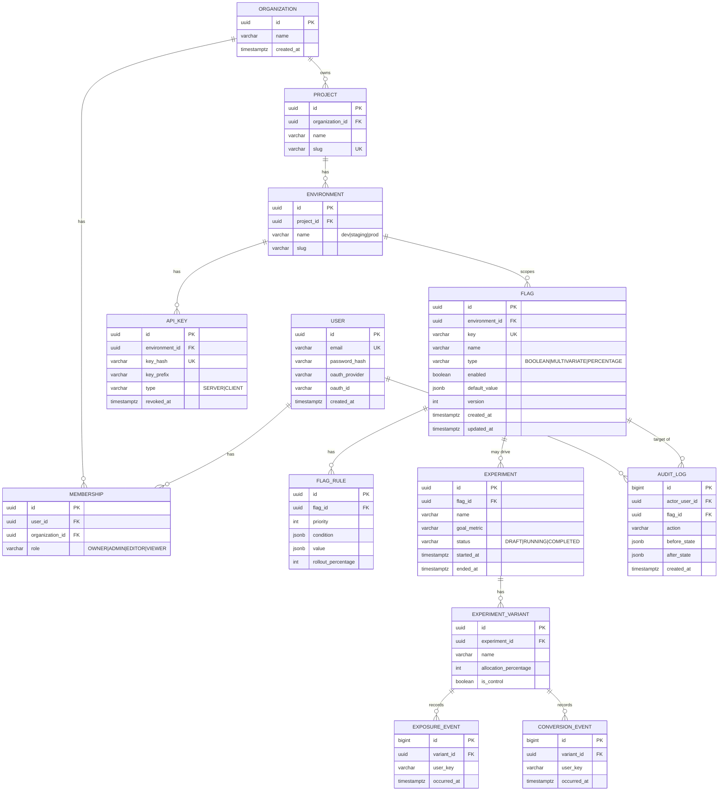

# Database Design

## ER Diagram



## DDL (PostgreSQL 16)

```sql
CREATE EXTENSION IF NOT EXISTS "pgcrypto";

CREATE TABLE organization (
    id UUID PRIMARY KEY DEFAULT gen_random_uuid(),
    name VARCHAR(120) NOT NULL,
    created_at TIMESTAMPTZ NOT NULL DEFAULT now()
);

CREATE TABLE app_user (
    id UUID PRIMARY KEY DEFAULT gen_random_uuid(),
    email VARCHAR(255) NOT NULL UNIQUE,
    password_hash VARCHAR(255),
    oauth_provider VARCHAR(50),
    oauth_id VARCHAR(255),
    created_at TIMESTAMPTZ NOT NULL DEFAULT now(),
    CONSTRAINT chk_auth_method CHECK (password_hash IS NOT NULL OR oauth_provider IS NOT NULL)
);

CREATE TABLE membership (
    id UUID PRIMARY KEY DEFAULT gen_random_uuid(),
    user_id UUID NOT NULL REFERENCES app_user(id) ON DELETE CASCADE,
    organization_id UUID NOT NULL REFERENCES organization(id) ON DELETE CASCADE,
    role VARCHAR(20) NOT NULL CHECK (role IN ('OWNER','ADMIN','EDITOR','VIEWER')),
    UNIQUE (user_id, organization_id)
);

CREATE TABLE project (
    id UUID PRIMARY KEY DEFAULT gen_random_uuid(),
    organization_id UUID NOT NULL REFERENCES organization(id) ON DELETE CASCADE,
    name VARCHAR(120) NOT NULL,
    slug VARCHAR(120) NOT NULL,
    created_at TIMESTAMPTZ NOT NULL DEFAULT now(),
    UNIQUE (organization_id, slug)
);

CREATE TABLE environment (
    id UUID PRIMARY KEY DEFAULT gen_random_uuid(),
    project_id UUID NOT NULL REFERENCES project(id) ON DELETE CASCADE,
    name VARCHAR(50) NOT NULL,
    slug VARCHAR(50) NOT NULL,
    UNIQUE (project_id, slug)
);

CREATE TABLE api_key (
    id UUID PRIMARY KEY DEFAULT gen_random_uuid(),
    environment_id UUID NOT NULL REFERENCES environment(id) ON DELETE CASCADE,
    key_hash VARCHAR(255) NOT NULL UNIQUE,
    key_prefix VARCHAR(12) NOT NULL,
    type VARCHAR(10) NOT NULL CHECK (type IN ('SERVER','CLIENT')),
    created_at TIMESTAMPTZ NOT NULL DEFAULT now(),
    revoked_at TIMESTAMPTZ
);
CREATE INDEX idx_api_key_prefix ON api_key (key_prefix);

CREATE TABLE flag (
    id UUID PRIMARY KEY DEFAULT gen_random_uuid(),
    environment_id UUID NOT NULL REFERENCES environment(id) ON DELETE CASCADE,
    key VARCHAR(150) NOT NULL,
    name VARCHAR(200) NOT NULL,
    type VARCHAR(20) NOT NULL CHECK (type IN ('BOOLEAN','MULTIVARIATE','PERCENTAGE')),
    enabled BOOLEAN NOT NULL DEFAULT false,
    default_value JSONB NOT NULL DEFAULT 'false',
    version INT NOT NULL DEFAULT 1,
    created_at TIMESTAMPTZ NOT NULL DEFAULT now(),
    updated_at TIMESTAMPTZ NOT NULL DEFAULT now(),
    UNIQUE (environment_id, key)
);
CREATE INDEX idx_flag_environment ON flag (environment_id);

CREATE TABLE flag_rule (
    id UUID PRIMARY KEY DEFAULT gen_random_uuid(),
    flag_id UUID NOT NULL REFERENCES flag(id) ON DELETE CASCADE,
    priority INT NOT NULL DEFAULT 0,
    condition JSONB NOT NULL,        -- e.g. {"attribute":"country","operator":"eq","value":"IN"}
    value JSONB NOT NULL,            -- value returned if condition matches
    rollout_percentage INT CHECK (rollout_percentage BETWEEN 0 AND 100)
);
CREATE INDEX idx_flag_rule_flag ON flag_rule (flag_id, priority);

CREATE TABLE experiment (
    id UUID PRIMARY KEY DEFAULT gen_random_uuid(),
    flag_id UUID NOT NULL REFERENCES flag(id) ON DELETE CASCADE,
    name VARCHAR(200) NOT NULL,
    goal_metric VARCHAR(100) NOT NULL,
    status VARCHAR(20) NOT NULL DEFAULT 'DRAFT' CHECK (status IN ('DRAFT','RUNNING','COMPLETED')),
    started_at TIMESTAMPTZ,
    ended_at TIMESTAMPTZ
);

CREATE TABLE experiment_variant (
    id UUID PRIMARY KEY DEFAULT gen_random_uuid(),
    experiment_id UUID NOT NULL REFERENCES experiment(id) ON DELETE CASCADE,
    name VARCHAR(100) NOT NULL,
    allocation_percentage INT NOT NULL CHECK (allocation_percentage BETWEEN 0 AND 100),
    is_control BOOLEAN NOT NULL DEFAULT false
);

-- High-volume append-only tables: partition-friendly, no FK cascade needed on hot path
CREATE TABLE exposure_event (
    id BIGSERIAL PRIMARY KEY,
    variant_id UUID NOT NULL REFERENCES experiment_variant(id),
    user_key VARCHAR(255) NOT NULL,
    occurred_at TIMESTAMPTZ NOT NULL DEFAULT now()
);
CREATE INDEX idx_exposure_variant_time ON exposure_event (variant_id, occurred_at);

CREATE TABLE conversion_event (
    id BIGSERIAL PRIMARY KEY,
    variant_id UUID NOT NULL REFERENCES experiment_variant(id),
    user_key VARCHAR(255) NOT NULL,
    occurred_at TIMESTAMPTZ NOT NULL DEFAULT now()
);
CREATE INDEX idx_conversion_variant_time ON conversion_event (variant_id, occurred_at);

CREATE TABLE audit_log (
    id BIGSERIAL PRIMARY KEY,
    actor_user_id UUID REFERENCES app_user(id),
    flag_id UUID REFERENCES flag(id),
    action VARCHAR(50) NOT NULL,
    before_state JSONB,
    after_state JSONB,
    created_at TIMESTAMPTZ NOT NULL DEFAULT now()
);
CREATE INDEX idx_audit_flag_time ON audit_log (flag_id, created_at DESC);
CREATE INDEX idx_audit_actor_time ON audit_log (actor_user_id, created_at DESC);
```

## Design Notes

- **Why JSONB for `condition`/`value`/`default_value`?** Targeting rules are inherently variable-shape (`country == 'IN'`, `plan in ['pro','enterprise']`, `age > 18`). Modeling this as rigid columns would require a new migration per rule type. JSONB gives schema flexibility while still being indexable (`GIN` index can be added on `condition` if rule queries become a bottleneck) and queryable via Postgres's native JSON operators.
- **Why separate `exposure_event`/`conversion_event` tables instead of one generic `event` table?** Two focused, narrow tables (few columns, `BIGSERIAL` PK, no JSONB) are optimized for high insert throughput and simple aggregation queries (`COUNT(*) GROUP BY variant_id`). A generic events table with a `type` discriminator column would force every query to filter on type, wasting the index.
- **Why `key_hash` instead of storing raw API keys?** Same principle as password hashing — even if the DB is compromised, raw keys aren't exposed. Only a `key_prefix` (first 8 chars) is stored in plaintext for display purposes ("key ffk_a1b2***").
- **Indexing strategy:** every foreign key used in a `WHERE`/`JOIN` has a supporting index. Time-series tables (`exposure_event`, `audit_log`) are indexed on `(fk, timestamp)` composite to support the actual query pattern ("give me all conversions for variant X since date Y").
- **Query optimization example:** the experiment dashboard's core query (conversion rate per variant) is:
  ```sql
  SELECT v.name,
         COUNT(DISTINCT e.user_key) AS exposures,
         COUNT(DISTINCT c.user_key) AS conversions,
         ROUND(COUNT(DISTINCT c.user_key)::numeric / NULLIF(COUNT(DISTINCT e.user_key),0), 4) AS rate
  FROM experiment_variant v
  LEFT JOIN exposure_event e ON e.variant_id = v.id
  LEFT JOIN conversion_event c ON c.variant_id = v.id AND c.user_key = e.user_key
  WHERE v.experiment_id = :experimentId
  GROUP BY v.id, v.name;
  ```
  This relies on the `(variant_id, occurred_at)` indexes and avoids `SELECT *`; `EXPLAIN ANALYZE` should be run against seeded data (100k+ rows) before/after the index to document the improvement in the README as a concrete number.
