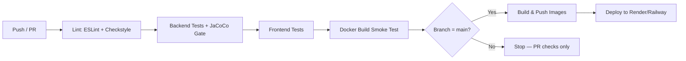

# DevOps & Deployment

## Local Development

```bash
docker compose up --build
```
Spins up: `backend` (Spring Boot), `frontend` (Vite dev server), `postgres`, `redis`, `nginx`.

## CI/CD Pipeline (GitHub Actions)



See `.github/workflows/ci.yml` in the repo root for the actual pipeline definition.

## Environments

| Env | Purpose | Config source |
|---|---|---|
| `local` | Docker Compose on developer machine | `.env` |
| `staging` | Auto-deployed from `develop` branch | Platform secrets |
| `production` | Auto-deployed from `main` branch (after manual approval gate) | Platform secrets |

## Containerization

- Backend: multi-stage Dockerfile (Maven build stage → slim JRE runtime stage) to keep the final image small.
- Frontend: multi-stage Dockerfile (Node build stage → Nginx static-serve stage).
- `docker-compose.yml` wires everything together locally with named volumes for Postgres data persistence.

## Reverse Proxy / Health Checks

Nginx sits in front of both the frontend static bundle and the backend API, handles TLS termination, and exposes:
- `GET /health` → proxies to Spring Boot Actuator `/actuator/health` (used by the hosting platform's health-check probe to decide if an instance is ready for traffic)

## Deployment Target

Free-tier friendly: **Render** (or Railway) for the backend + Postgres + Redis, **Vercel/Netlify** for the frontend static build. Chosen specifically because they support Docker deploys and free-tier managed Postgres/Redis, keeping the whole project deployable at $0/month for demo purposes.

## Secrets

Never committed. `.env.example` documents every required variable with placeholder values; actual secrets live in GitHub Actions repo secrets (for CI) and the hosting platform's secret manager (for runtime).
